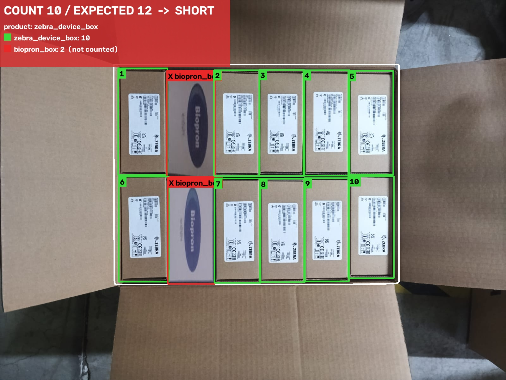

# Carton Content Verification

Takes a photo of an open carton and an expected quantity. Draws a box and product label on every item in the top layer, shows the total and per-product counts, and gives **PASS / SHORT / OVER**.

```bash
python run.py --image img_02.jpg --expected 12
# -> outputs/img_02_annotated.jpg  (+ JSON summary on stdout)
```


*img_09 with 2 boxes replaced by a different product (Biopron). The 2 foreign items are flagged in red and not counted: 10 of 12 → SHORT.*

The full experiment log, with every number and failure case, is in **[REPORT.md](REPORT.md)**.

---

## Setup (clean machine)

Needs Python 3.10–3.12. The main pipeline runs on CPU, and a GPU is optional.

```bash
python -m venv .venv && source .venv/bin/activate
pip install -r requirements.txt
python run.py --image data/raw/img_02.jpg --expected 20
```

- The trained weights are in `weights/` (27 MB): `item_det.pt`, `carton_seg.pt` and `gallery.npz`.
- On the first run, DINOv2 ViT-S/14 (~90 MB) downloads automatically from the Hugging Face Hub.
- **Optional SAM2 cross-check.** A GPU is recommended; about 0.9 GB of weights download on first use.
  ```bash
  pip install -r requirements-verify.txt
  python run.py --image data/raw/img_07.jpg --expected 12 --verify
  ```
  `--verify` counts the carton a second way with SAM2 and adds **REVIEW** to the banner if the two counts differ by 2 or more.
- Other flags:
  - `--device cpu|cuda` (picked automatically if left out)
  - `--out DIR`
- To re-run on every sample: `python tools/eval_all.py`. It writes `outputs/*_annotated.jpg` and `outputs/summary.json`.

## How it works

| Stage | Model | Purpose |
|---|---|---|
| 1. Carton opening | YOLO11n-seg (trained) | Find the inside of the carton. **Everything outside is greyed out** before item detection, so shelves, floor and nearby boxes can never be counted. |
| 2. Items | YOLO11s (trained, one class: `item`) | Box every top-layer item. The detector ignores product type, so it isn't tied to 7 fixed products. |
| 3. Product ID | DINOv2 ViT-S/14 + reference crops ("gallery") | Name each box by nearest-neighbour search against example crops of each product. |
| 4. Main product | Majority vote + similarity margin | The carton's main product is counted. Items that clearly match a *different* product are shown in red as foreign and **not counted**. |
| 5. Optional check | SAM2.1-L + DINOv2 | Recount using SAM2 segments that look like the 3 most confident items, and flag disagreements. |

## README questions

### Which approach, and why over the alternatives?

**A trained detector that ignores product type, plus a product-matching step (DINOv2 against example crops), with SAM2 as an optional cross-check.**

| | Accuracy | Speed per image | Cost per image | Scaling |
|---|---|---|---|---|
| **This (YOLO11s + DINOv2)** | 10/10 on samples. 3/10 exact with the product type held out of training (see below) | **0.2 s T4 GPU, ~0.9–1.5 s on CPU** | $0 (runs locally) | New product = add ~5 example crops. Retraining is optional. |
| Ready-made detectors (Grounding DINO / OWLv2), no training | Wrong on 4/10 samples. Merges touching items, counts things outside the carton | ~1–2 s GPU | $0 | Relies on the right prompt for each product |
| SAM2 exemplar counter as the *main* counter | 3/10 exact, mean error 1.6. Counts carton walls and labels as items | 6.8 s T4, about 60 s CPU | $0 | No training, but too slow for 2 s |
| Vision LLM (Claude/GPT/Gemini) | Not benchmarked. Counting 20–30 look-alike items is a known weak spot and the boxes are imprecise | 3–8 s | ~$0.01–0.03 | Pay per carton, forever, and depends on network and API |

The detector is the only option that meets the 2-second target on a CPU with no running cost. SAM2 goes wrong in different ways from the detector, which is why it's useful as a second opinion rather than the main counter.

### How did you handle having only 7 (actually 10) images?

- **Labelling:**
  - Grounding DINO + OWLv2 + SAM (run on a Kaggle GPU) drew *first-draft* boxes.
  - Every box was then checked by hand, and 6 images were redrawn entirely (including the blisters, rolls and yellow ribbons).
  - Result: 202 item boxes and 10 carton outlines in `data/labels.json`.
- **Synthetic data** (`carton/augment.py`), 140 variants per image:
  - **Item copy-paste.** Items are removed (replaced with cardboard texture), which gives SHORT cases. Items are pasted into empty space, which gives OVER cases. Some items are **swapped for other products**, so the detector learns "an item", not "a Biopron box". Every sample has a different count, so the model can't memorise "12".
  - **Synthetic hands and arms** in skin and glove colours. Items more than 60% covered are dropped from the labels.
  - **Carton outline jitter.** The outline grows or shrinks, and the outside is sometimes not greyed out, so the detector copes with an imperfect carton outline.
  - Geometry and lighting: rotations of 90°, 180° and 270° (the photos come in any orientation), perspective, scale, motion/defocus blur, noise, JPEG artifacts, shadows, and brightness, contrast and color changes. YOLO's own mosaic mixing is added on top.
- **Honest testing:** a 4-fold **leave-products-out** test. The detector never sees the product type it's tested on. This is harsher than the real test.
- **Prompting / no-training option:** a SAM2 exemplar counter that needs no training (see REPORT.md §4).

### What are your results on the samples, and where does it fail?

| Test | Exact count | Mean error | Box P / R |
|---|---|---|---|
| Final model on the 10 samples (**trained on them, optimistic**) | **10/10** | 0.0 | 1.00 / 1.00 |
| Leave-products-out (product type never seen in training) | 3/10 | 2.4 | 0.85 / 0.85 |
| Foreign-item test (2 items swapped for another product), final model | 10/10 | 0.0 | – |
| SAM2 exemplar counter, no training (my outlines + 3 example crops) | ~6/10 | 0.9 | 0.94 / 0.91 |

Annotated outputs for all samples are in `outputs/`. **Where it fails** (details in REPORT.md §5):
- **Products that aren't box-shaped and weren't in training.**
  - The yellow ribbon packages are two mirrored halves, and a model that hasn't seen them counts 20 instead of 10.
  - Overlapping clear blisters come out at 15/20.
  - Loose rolls at different heights come out at 18/21.
- **Near-misses.** One missed box turns PASS into SHORT, so the count must be exact.
- **"Top layer only."** Items one layer down that show through gaps could be counted. This didn't happen on the samples, but it isn't tested.
- **SAM2 cross-check:** carton walls and flaps look like the brown Honeywell and Zebra boxes, and white labels get segmented as separate items.

### How would the system handle a new product type next month?

1. **No retraining needed to count it.** The detector doesn't depend on product type, and the SAM2 check uses the carton's own items as example crops.
2. **Register the product.** Add about 5 photos' worth of example crops to the gallery (`build_gallery` in `carton/pipeline.py`), and the product is named in the output right away. This takes minutes and no GPU.
3. **Fine-tune for accuracy.** Once 20–50 real photos of the product have been collected (the REVIEW flag shows which cartons need a human check), add them to the labels and re-run `kaggle/train/train.py`. That takes about 35 min on a Kaggle T4. The leave-products-out test above measures step 1 only.

### How would you run it at 2 seconds per carton with a worker's hands in frame?

- **Speed:**
  - The main path is already 0.2 s on a T4, and about 1 s on a standard CPU.
  - For a small edge box, export both YOLO models to ONNX or TensorRT (Jetson Orin: under 50 ms) and run DINOv2 on only the boxes.
  - Run the SAM2 check only when needed: for low-confidence detections, or asynchronously after the PASS/SHORT result is shown.
- **Hands:**
  - Training already includes synthetic arms, hands and gloves.
  - On a live overhead camera, **don't judge a single frame.** Process frames continuously and only accept a result when (a) no hand or arm is detected over the carton (add a `hand` class, or use a small person/hand model) and (b) the count has stayed the same for N frames in a row (for example 3 frames ≈ 0.5 s).
  - The last stable count is shown, which also makes it robust to blur and glare.
- **Setup:** mount the camera overhead, pointing straight down, with even lighting. That removes most of the perspective and shadow problems that the phone photos have.

## Paid API costs

None. Everything runs locally. Training used about 1.5 GPU-hours of free Kaggle T4 time.

## Repository layout

```
run.py                     single-command entry point
carton/pipeline.py         carton outline, item detection, product ID, main-product consensus
carton/sam_counter.py      SAM2 exemplar counter (--verify)
carton/augment.py          synthetic training data (copy-paste, hands, geometry, lighting)
carton/draw.py             annotated output
weights/                   trained detector, carton segmenter, product gallery
data/raw, data/labels.json the 10 photos + hand-checked labels
tools/                     draft labels, label builder, batch evaluation
kaggle/                    Kaggle GPU scripts: auto-labelling, training (cv/final), SAM2 experiments
outputs/                   annotated outputs for all samples + demos
results/                   raw JSON results of every experiment
```

## Notes and assumptions (would have emailed)

- The zip contained **10 photos, not 7**, with different file names. There is a second Biopron and a second Zebra photo, plus **blue ribbon rolls (Image-5)**, which aren't in the product list. All 10 were used, and the blue rolls are `ribbon_roll_blue`.
- **`orders.csv` was not included.** "Expected" counts come from my hand labels and are used only for the PASS/SHORT/OVER display and evaluation. The pipeline never sees them.
- A carton is assumed to hold one product. Anything else inside it is reported as foreign and not counted.
