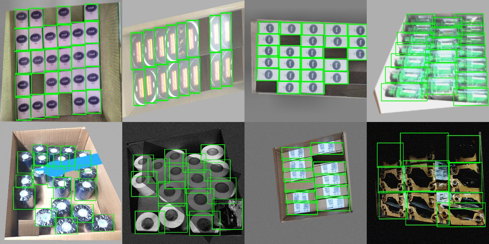

# Carton Content Verification: Experiment Report

A summary of what was tried, what was measured, and why the final design looks the way it does. The raw numbers for every table are in `results/*.json`.

## 1. Data

| Photo | Product | Items (top layer) | Notes |
|---|---|---|---|
| img_01 | biopron_box | 30 | Shelf products at both sides |
| img_02 | vovemac_plus_box | 20 | Some boxes upside down, one shown from the back |
| img_03 | biopron_box | 30 | Rotated photo, other cartons nearby |
| img_04 | zebra_ribbon_green_blister | 20 | Overlapping clear blisters, Zebra box *outside* the carton |
| img_05 | ribbon_roll_blue | 21 | Loose rolls at different heights (not in the task's product list) |
| img_06 | label_roll_white | 16 | Loose rolls |
| img_07 | honeywell_device_box | 12 | One box without its label |
| img_08 | zebra_ribbon_yellow | 10 | 3×3 plus 1 tilted on top, Evolis box outside |
| img_09 | zebra_device_box | 12 | Box on the floor outside the carton |
| img_10 | zebra_device_box | 11 | Half-empty carton with shadows in the empty slots |

**Labelling.** Grounding DINO (base) + OWLv2 (large) + SAM (ViT-H) drew first-draft boxes on a Kaggle GPU (`kaggle/autolabel/`). I then reviewed every image on a coordinate grid. The drafts were kept for img_01, 03, 06 and 09 after removing boxes outside the carton. img_02, 04, 05, 07, 08 and 10 were redrawn by hand, and all carton outlines are hand-drawn (`tools/build_labels.py`).

## 2. Ready-made models, no training

On their own, the ready-made auto-labelling models were:

| Image | 01 | 02 | 03 | 04 | 05 | 06 | 07 | 08 | 09 | 10 |
|---|---|---|---|---|---|---|---|---|---|---|
| Found / true | 35/30 | 20/20 | 30/30 | **1/20** | **11/21** | 16/16 | 14/12 | **3/10** | 13/12 | 11/11 |

They fail by merging touching items into one box (img_04, 08), by missing items (img_05), and by counting objects outside the carton (img_01, 07, 09). That's the problem from the task brief, and the reason for the carton outline step plus a trained detector.

## 3. Trained pipeline (YOLO11 + DINOv2)

- **Training data** (`carton/augment.py`): 140 item samples and 70 carton samples per photo. Item samples use copy-paste (remove, add or swap items), synthetic hands, carton-outline jitter, geometry changes and lighting changes. Examples:

  

- **Final model:**
  - YOLO11s item detector at 960 px, 45 epochs.
  - YOLO11n-seg carton model at 640 px, 45 epochs.
  - Trained on 2× T4 in 35 min (`kaggle/train/train.py`, MODE=final).

**3a. Final model on the 10 samples (it trained on these):** 10/10 exact counts, 10/10 product correct, box precision and recall 1.00/1.00. Time per image: 0.21 s on a T4 GPU, about 0.9–1.5 s on CPU. This shows the pipeline is correct end to end. It is **not** a measure of how well it generalises.

**3b. Leave-products-out test** (4 folds, 30 epochs each, about 6.5 min per fold). Each fold hides one or more products from the detector's training:

| Held out | GT | Count | Box TP / FP / FN |
|---|---|---|---|
| img_01 Biopron | 30 | 30 | 30/0/0 |
| img_03 Biopron | 30 | 30 | 30/0/0 |
| img_05 blue rolls | 21 | 18 | 14/4/7 |
| img_02 Vovemac | 20 | 17 | 17/0/3 |
| img_06 white rolls | 16 | 17 | 16/1/0 |
| img_04 green blisters | 20 | 15 | 11/4/9 |
| img_07 Honeywell | 12 | 11 | 11/0/1 |
| img_08 yellow ribbons | 10 | **20** | 2/18/8 |
| img_09 Zebra | 12 | 13 | 12/1/0 |
| img_10 Zebra | 11 | 11 | 11/0/0 |
| **Total** | | **3/10 exact, mean error 2.4** | **P 0.85, R 0.85** |

Neat rows of boxes carry over well to new products. Loose rolls, clear blisters and two-part packages don't: the detector trained without yellow ribbons splits each package into its two yellow halves. The real test uses unseen photos of the *same* products, which falls somewhere between 3a and 3b. We can't measure it because only Biopron and Zebra have a second photo, and those came out exactly right.

**3c. Foreign items:** 2 items per image were replaced with crops of a different product. With the final model, **10/10** came out right: the swapped items were labelled with their real product and not counted. With product types held out, only 2/10 came out right. The errors there come from the detector, not from the product matching. Demo: `outputs/demo_foreign_items_img_09.jpg`.

## 4. SAM2 exemplar counter (no training)

Method (`kaggle/sam2_exemplar/exemplar.py`, `carton/sam_counter.py`):
1. SAM2.1 "segment everything" (32×32 points) runs on the carton area, with the outside greyed out.
2. Each segment is compared by DINOv2 similarity to 3 example crops, including their rotations and flips. Segments are kept if the similarity is at least τ and the size is between 0.35× and 2.5× of the examples.
3. Duplicates are removed (overlap above 0.4), and so are segments that sit more than 60% inside an item already kept.

**4a. Controlled experiment**, with my hand-drawn outlines and 3 random example crops (3 random draws):

| τ | exact (same-photo examples) | mean error | Cross-photo examples (Biopron 01↔03, Zebra 09↔10) |
|---|---|---|---|
| 0.45 | 0.53 | 1.00 | 30/30, 28–32/30, 12/12, 13/11 |
| **0.50** | **0.57** | **0.90** | 29–30/30, 28–32/30, 12/12, 13/11 |
| 0.60 | 0.53 | 0.97 | 22–25/30, 20–30/30, 12/12, 11–12/11 |
| 0.70 | 0.50 | 1.17 | 21–24/30, 17–26/30, 12/12, 8–11/11 |

At τ=0.5, box precision and recall are 0.94/0.91. It fixes the yellow-ribbon split (11/10 against YOLO's 20/10 when held out). τ was chosen on these same images, so the numbers are slightly optimistic.

**4b. Fully automatic** (the model's carton outline, example crops = the 3 most confident YOLO items):

| SAM2.1 size | exact | mean error | Time per image (T4) |
|---|---|---|---|
| hiera-large | 3/10 | 1.6 | 6.8 s |
| hiera-base+ | 4/10 | 1.9 | 6.6 s |
| hiera-small | 3/10 | 3.5 | 6.4 s |
| hiera-tiny | 5/10 | 3.1 | 6.2 s |

On CPU, SAM2 takes about 60–85 s per image. Failure modes seen:
- Carton walls and flaps get picked up for brown cardboard products (img_07: 15/12, see `results/sam2_verify_examples/`).
- White labels get segmented as separate items.
- Smaller SAM2 sizes break items into pieces (yellow ribbon 2–4/10).

**Decision:** SAM2 is **too slow for the 2 s target and not accurate enough as the main counter**. It goes wrong in different ways from YOLO, though, so it ships as an optional `--verify` cross-check. The main count comes from YOLO, and a disagreement of 2 or more raises **REVIEW**. On img_07 that flag fired and pointed at the carton-wall problem.

## 5. Known failure modes and next steps

1. **Products that aren't box-shaped** (blisters, rolls, two-part cartridges) generalise poorly from about one photo per product.
   - Fix: 30–50 real photos per product from the actual station camera.
   - Also: pre-train the detector on a public densely packed product dataset such as SKU-110K (about 11k images; check the license for commercial use).
2. **Exact counts are unforgiving.** Show the REVIEW flag and the per-item boxes, so a packer can confirm in a second instead of recounting.
3. **Top-layer rule.** There are no photos of items showing through gaps from a lower layer. Adding a "depth/shadow" negative class or a size check would handle it.
4. **SAM2 check:** drop segments that touch the carton wall, and reject segments that are mostly flat white (labels). Both are cheap filters that would fix most of its false counts.

## 6. Reproducing

| Step | Where | Time |
|---|---|---|
| Draft labels | `kaggle/autolabel/autolabel.py` (Kaggle T4) | ~5 min |
| Review and build labels | `tools/draft_labels.py`, `tools/grid.py`, `tools/build_labels.py` | manual |
| Leave-products-out test | `kaggle/train/train.py` with `MODE="cv"` | ~30 min |
| Final training | `kaggle/train/train.py` with `MODE="final"` | ~35 min |
| SAM2 experiments | `kaggle/sam2_exemplar/exemplar.py`, `kaggle/final_eval/final_eval.py` | ~15 min each |
| Outputs | `python tools/eval_all.py` | ~15 s CPU |
